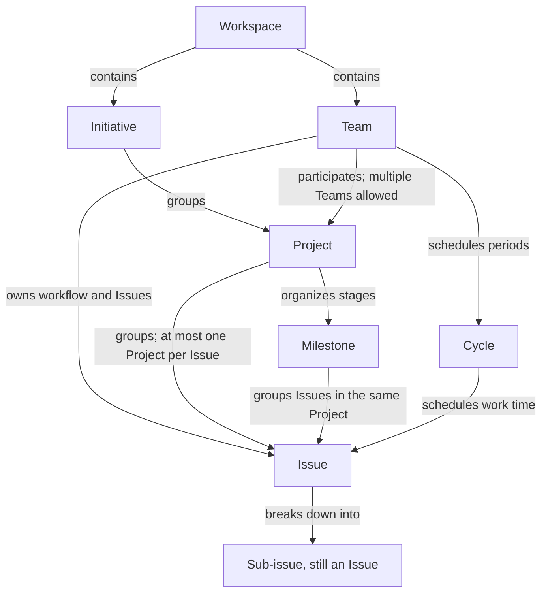

# Linear object relationships and feature selection

Verified: 2026-09-12.
Context: an individual developer with multiple Agents.
Research baseline: [scope-and-sources.md](scope-and-sources.md); project policy: [AGENTS.md](../AGENTS.md).

This document establishes feature facts from official documentation and labels feature choices and examples as recommendations.
Sections, evidence status, and limitations for “Workspaces” through “Assign and delegate issues,” and “GitHub,” appear at the end.

## Object relationships

The following feature facts are confirmed by documentation.

| Object | Relationships and purpose | Native constraints / notes and sources |
| --- | --- | --- |
| Workspace | Container for an organization’s work, including Teams, Issues, and other objects | One account can use multiple Workspaces, each with its own membership and billing plan. [Workspaces](https://linear.app/docs/workspaces#multiple-workspaces) |
| Team | Owns Issues and their workflow; can participate in Projects | Every Issue belongs to one Team; multiple Teams can share a Project. [Teams](https://linear.app/docs/teams#tips-on-structuring-teams) |
| Initiative | Groups Projects around a goal to provide a cross-project progress view | Workspace-level and Team-led Initiatives have different visibility rules; grouping alone does not establish access. [Initiatives](https://linear.app/docs/initiatives#who-can-see-initiatives) |
| Project | Groups Issues around a shared result, stores documents, and tracks progress | An Issue belongs to at most one Project at a time; a completion date is optional. [Projects](https://linear.app/docs/projects#add-issues-to-a-project) (also see FAQ) |
| Milestone | Organizes completion stages within one Project and groups that Project’s Issues | Cannot be shared across Projects; dates are optional. [Project milestones](https://linear.app/docs/project-milestones#faq) (also see Create milestones) |
| Cycle | A Team’s recurring time window for scheduling Issues | Must be enabled for the Team; duration is 1–8 weeks and is not tied to releases; Issues cannot be scheduled into cooldown. [Cycles](https://linear.app/docs/use-cycles#cycle-settings) |
| Issue | A trackable, verifiable work unit that moves through its Team’s workflow; can join a Project or Cycle | Has one Assignee at a time; native delegation can retain a human Assignee while an Agent with Team access executes. [Concepts](https://linear.app/docs/conceptual-model#issues), [Assign and delegate issues](https://linear.app/docs/assigning-issues#delegating-to-agents) |
| Sub-issue | An Issue with a parent relationship, used to break down larger work | Can cross Teams and use a different Project from its parent. Creation copies Team, Priority, and Project; Cycle inheritance is conditional, and Labels are not inherited. [Teams](https://linear.app/docs/teams#tips-on-structuring-teams), [Projects](https://linear.app/docs/projects#add-issues-to-a-project), [Parent and sub-issues](https://linear.app/docs/parent-and-sub-issues#copy-properties) |

Arrows show different relationships, not a mandatory sequence of layers to create.
The diagram does not define the complete cardinality of every relationship; unresolved rules appear under limitations.
Sources: [Workspaces](https://linear.app/docs/workspaces#overview), [Teams](https://linear.app/docs/teams#tips-on-structuring-teams), [Initiatives](https://linear.app/docs/initiatives#overview), [Project milestones](https://linear.app/docs/project-milestones#overview), [Concepts](https://linear.app/docs/conceptual-model#how-these-concepts-fit-together), [Parent and sub-issues](https://linear.app/docs/parent-and-sub-issues#overview).

Cycles and Milestones represent different dimensions: work time and delivery stage, respectively.
An Issue can record both a Project and a Cycle; a Cycle need not be a child layer of a Project. [Concepts](https://linear.app/docs/conceptual-model#issues)

## Behaviors that affect modeling

- Team limits depend on the plan: Free allows 2, Basic 5, and Business/Enterprise unlimited. The current Workspace plan was not confirmed. [Teams](https://linear.app/docs/teams#team-limits)
- Workspace-level Initiatives are visible to non-guest members; private Projects within them retain restricted access. Team initiatives require Business/Enterprise; private Team-led Initiatives are visible only to people with access to that Team. [Initiatives](https://linear.app/docs/initiatives#team-initiatives)
- Sub-initiatives require Enterprise, support up to five levels and multiple parents, and aggregate Projects upward; visibility documentation differences appear under limitations. [Sub-initiatives](https://linear.app/docs/sub-initiatives#basics)
- Parent auto-close and Sub-issue auto-close are optional Team settings: they can close a parent when all children are Done, or close remaining children when the parent is Done. The environment was not inventoried, so enablement is not assumed. [Parent and sub-issues](https://linear.app/docs/parent-and-sub-issues#status-automation)
- Converting a parent to a Project makes the parent and children independent Issues in the Project, renames the original parent, and removes parent relationships. [Parent and sub-issues](https://linear.app/docs/parent-and-sub-issues#turn-issues-into-projects)
- Unfinished work generally rolls over when a Cycle ends, with exceptions for items moved to backlog, triage, canceled, or completed during cooldown. Unfinished items cannot remain in a closed Cycle. [Cycles](https://linear.app/docs/use-cycles#issues-rollover)

## Feature selection table

These handbook recommendations follow object purposes and maintenance cost; they are not platform requirements.

| Problem | Choice | Rationale and tradeoffs |
| --- | --- | --- |
| One person manages multiple products and Agents | Start with one Workspace and one Team | Keep a shared workflow; a new Team should address independent workflow, permissions, or scheduling needs. Official guidance also recommends starting with few Teams when unsure. [Workspaces](https://linear.app/docs/workspaces#overview), [Teams](https://linear.app/docs/teams#overview) |
| One independently verifiable work item | Issue | State the deliverable, evidence, and completion criteria directly, reducing maintenance overhead |
| One outcome needs several independently transferable work items | Parent + Sub-issues | The parent retains the overall result and integration acceptance; each child has its own deliverable and owner. This follows official guidance for smaller groups of work. [Parent and sub-issues](https://linear.app/docs/parent-and-sub-issues#overview) |
| Multiple work items need a shared brief, stages, target dates, and ongoing progress updates | Project | Use dedicated Project context and progress features; coordination needs determine the choice, without a fixed issue-count threshold. [Projects](https://linear.app/docs/projects#overview) |
| One Project has stages such as Alpha, Beta, and general release | Milestone | Give each stage a determinable result; a stage can contain several parents and independent Issues |
| Multiple Projects serve a longer-term goal | Initiative | Establish an explainable shared goal before grouping; one deliverable generally needs only a Project |
| Review committed work weekly or every two weeks | Cycle | Schedule work across Projects using one Team’s cadence; establish a regular review habit before enabling |
| Multiple Agents execute separately | Independently verifiable Issues/Sub-issues | State execution scope and handoff entry points in each Issue; Agent count does not justify more Teams. Native delegation prerequisites appear in “Assign and delegate issues”; mapping external MCP sessions to Agents has not been tested |

### Project versus parent issue

1. Write the expected result and integration acceptance first.
2. Use an Issue directly when it can deliver the full result.
3. Use a parent when breaking down execution of the same result, with children delivering verifiable parts.
4. Use a Project when an independent brief, stages, and ongoing project progress management are needed; parents can still group smaller work within it.
5. Reassess when scope expands. Before conversion, identify parent descriptions and relationships to preserve, then verify against the conversion behavior in “Parent and sub-issues.”

A parent can group research work whose sub-issues each deliver independently readable documents.
The parent verifies the overall result against its own completion criteria.
This is project policy; platform auto-close settings require separate confirmation.

## Products and Git repositories

The following mapping is a recommendation: a product represents the long-term audience and value, a Project represents a deliverable result, and a repository records code location.
A product can evolve through multiple Projects; one Project may need several repositories or change only part of a monorepo.
This is a work-modeling approach, not a claim that Linear provides a native Product field with this definition.

| Context | Recommended record |
| --- | --- |
| One product, one repo | Create Projects for feature launches, improvements, or migration outcomes; link the same repo in each brief |
| One product, multiple repos | List frontend, API, infra, and other repos with responsibilities in the brief; identify the relevant paths and delivery verification in each Issue |
| One monorepo, multiple products | Specify product and directories in the brief; record affected packages in Issues rather than defining scope only by repo name |
| Multiple products share a component | Give shared-component improvements an independent Issue/Project; consumers record their own adoption and verification work, linking prerequisite results |

Because each Issue can join only one Project at a time, give shared results one primary home. Other Projects should link and explain their use; create separate children only where each has its own delivery and acceptance. [Projects](https://linear.app/docs/projects#add-issues-to-a-project)

GitHub integration has additional constraints, so the table does not establish sync feasibility:

- Issues Sync connects a GitHub repo and a Linear Team. Multiple repos can sync one-way into the same Team, but only one repo can use bidirectional sync at a time. [GitHub](https://linear.app/docs/github#configure-github-issues-sync)
- Issues Sync handles newly created Issues by default; existing GitHub Issues require import. [GitHub](https://linear.app/docs/github#configure-github-issues-sync)
- One GitHub organization cannot connect to multiple Linear Workspaces; check integration impact before splitting Workspaces. [GitHub](https://linear.app/docs/github#add-multiple-github-organizations)

These “GitHub” findings cover only documented constraints affecting mapping choices; full research into PRs, commits, sync configuration, and connector capabilities belongs to later integration work.

## Three modeling examples

The following are design examples with walkthrough acceptance.

### Example 1: fix a login error in one product

- Context: a product in one repo needs an error-message fix for expired tokens.
- Structure: existing Team → one Issue, listing the repo/paths, error scenario, and verification entry point.
- Choice: the result is independently verifiable in one delivery, so track it directly as an Issue; add it to a Cycle only if one is already used.
- Expansion condition: if investigation identifies separate API and frontend-message deliverables, make the original Issue a parent with two children and verify end-to-end behavior at the parent.

- [x] The Issue has one Team and may omit a Project; both the initial result and expanded integration acceptance are locatable.

### Example 2: launch a paid plan across frontend and API repos

- Context: one developer with multiple Agents works in separate frontend and API repos.
- Structure: one Team → “Launch a paid plan” Project → “Payments ready for testing” and “Production subscriptions available” Milestones.
- Decomposition: “Complete the subscription flow” is a parent with API, frontend, and end-to-end verification children. Each child records repo, deliverable, and acceptance; the Project brief summarizes both repos.
- Scheduling: if Cycles are in use, schedule API and frontend Issues according to current capacity; work spanning periods retains its Project and delivery stage.
- Choice: Project manages shared delivery, parent manages local integration, Milestone expresses stage, and Cycle expresses time. Repo count does not determine Team count.

- [x] Each Issue has one Project; Milestones belong to that Project; work locations in both repos are clear.
- [x] Issues Sync requires choosing a one-way/bidirectional combination under “GitHub”; both repos cannot be assumed to sync bidirectionally with the same Team.

### Example 3: migrate two products in a monorepo to a new login system

- Context: product A, product B, and an auth package share one repo; each product can be accepted in stages.
- Structure: existing Team; a “Unify the login experience” Initiative groups “Shared auth capability,” “Product A migration,” and “Product B migration” Projects.
- Decomposition: shared auth Issues belong to the shared-capability Project; adoption Issues for A and B belong to their respective Projects and reference shared deliverables and verification entry points.
- Stages: A and B each create “Pilot” and “Full rollout” Milestones in their own Project; identically named stages are maintained separately.
- Choice: independent release and acceptance justify separate Projects; the shared goal justifies an Initiative. Keep the common Team workflow initially, and reevaluate Teams if different permissions or scheduling are needed later.

- [x] Shared Issues do not belong to several Projects simultaneously; each Project’s directory scope can be recorded clearly in one repo.
- [x] Each Milestone belongs to its own Project; the Initiative has a clear grouping rationale, with no shared cross-Project Milestone.

## Source records

All sources below are published by Linear and were verified on 2026-09-12.
Page-level publication/update dates were not confirmed; evidence status is “documented.”
The visibility difference between “Initiatives” and “Sub-initiatives” is additionally marked “conflicting”; see the next section.
Section names support in-page searching; web links point to the relevant pages and sections.

| Title and URL | Sections / supported conclusions | Limitations |
| --- | --- | --- |
| [Workspaces](https://linear.app/docs/workspaces) | Overview, Multiple workspaces; container, separate membership and billing | Cross-Workspace migration and permissions were not tested |
| [Teams](https://linear.app/docs/teams) | Overview, Team limits, Tips on structuring teams; Team selection, counts, cross-Team relationships | Actual Workspace plan and Team settings govern |
| [Initiatives](https://linear.app/docs/initiatives) | Overview, Who can see initiatives, Team initiatives; grouping and visibility | Team initiatives require Business/Enterprise; scope differs from “Sub-initiatives” |
| [Projects](https://linear.app/docs/projects) | Overview, Add issues to a project, Multi-team projects, FAQ; outcomes, single membership, optional dates | Product functionality does not guarantee connector operations |
| [Project milestones](https://linear.app/docs/project-milestones) | Overview, Create milestones, Add milestones to issues, FAQ; stages and single-Project scope | Progress metrics are not acceptance evidence |
| [Cycles](https://linear.app/docs/use-cycles) | Cycle settings, Issues rollover, FAQ; scheduling and rollover | Team enablement and automations were not inventoried; Sub-team schedule inheritance is outside the first version’s minimum setup |
| [Concepts](https://linear.app/docs/conceptual-model) | Issues, Cycles, How these concepts fit together; Issues and multiple dimensions | Conceptual explanation, not a complete API schema |
| [Parent and sub-issues](https://linear.app/docs/parent-and-sub-issues) | Overview, Copy properties, Status automation, Turn issues into projects | Inheritance occurs at creation; continuous field synchronization was not established |
| [Sub-initiatives](https://linear.app/docs/sub-initiatives) | Basics, Visibility and filtering; five levels, multiple parents, visibility | Enterprise; visibility exceptions relative to “Initiatives” remain unresolved |
| [Assign and delegate issues](https://linear.app/docs/assigning-issues) | Overview, Delegating to agents; Assignee and delegation | Native Agents need Team access; external MCP does not automatically gain that identity |
| [GitHub](https://linear.app/docs/github) | Configure GitHub Issues Sync, Add multiple GitHub organizations | Only modeling-related constraints are extracted; GitHub Enterprise differences, integration authorization, and actual settings were not verified |

## Limitations and open questions

- Initiative visibility: “Initiatives” describes access restrictions for private Team-led Initiatives; “Sub-initiatives” broadly states in Visibility and filtering that non-guest Workspace members can see Sub-initiatives without discussing that exception. This may reflect different scopes, but was not tested. Verify actual visibility before handling sensitive goals. None of these examples relies on private Initiatives.
- The complete rules for a Project directly belonging to multiple Initiatives, maximum Issue parent depth, and full cardinality of Issue Cycle/Milestone fields were not established. The diagram and recommendations do not depend on those unresolved rules.
- This Workspace’s plan, Cycles, and automations were not confirmed; verify feature availability and API/MCP write capabilities before concrete operations.

## Acceptance and handoff

- [x] All eight object relationships and included native constraints have official sources.
- [x] Feature choices are labeled recommendations; Project/parent decisions and product/repo mappings are complete.
- [x] All three examples passed walkthrough checks of Team, Project, Milestone, and sync constraints.
- [x] All eleven sources have URLs, sections, verification dates, evidence status, and limitations.
- [x] Documentation differences and unresolved rules affecting adoption have explicit boundaries.

Follow-up operations:

- [Environment inventory](../skills/linear-handbook/references/workspace-setup.md): confirm actual settings.
- [Project brief workflow](../skills/linear-handbook/references/project-planning.md): turn requirements into project goals.
- [Issue types guide](../skills/linear-handbook/references/issue-types.md): choose issue types and parents.
- [Feature coverage research](feature-coverage.md): confirm plan and feature restrictions.
- [Tool capability research](agent-tool-capabilities.md): confirm API and MCP operating scope.
