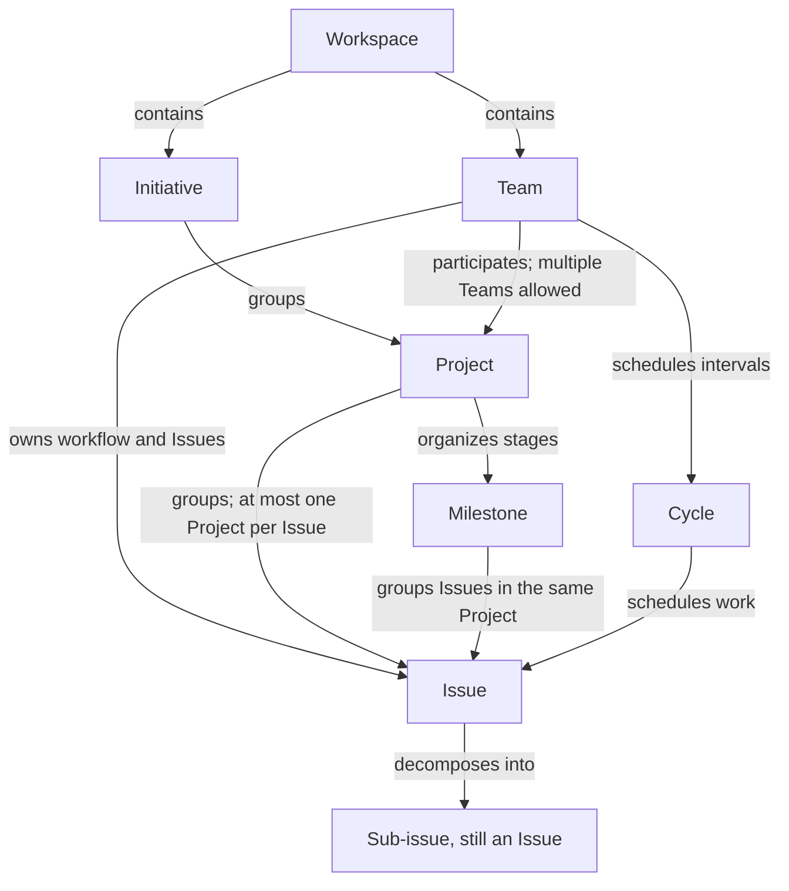

# Linear object relationships and feature selection

Verified: 2026-09-12.
Context: an individual developer with multiple Agents.
Evidence rules: [policy](policy.md#evidence-and-sources).
Edition policy: [writing rules](writing.md).

This document uses official documentation to establish feature facts; feature choices and examples are recommendations.
The source records at the end list sections, evidence status, and applicability limits.

## Object relationships

The following feature facts are confirmed in documentation.

- Workspace
  - Relationship and purpose: the container for an organization's work, including Teams and Issues.
  - Native limits, considerations, and sources
    - One account can use multiple Workspaces.
    - Each has its own member list and billing plan.
    - [Workspaces](https://linear.app/docs/workspaces#multiple-workspaces).
- Team
  - Relationship and purpose
    - Owns Issues and their workflow.
    - Can participate in Projects.
  - Native limits, considerations, and sources
    - Each Issue belongs to one Team.
    - Multiple Teams can share a Project.
    - [Teams](https://linear.app/docs/teams#tips-on-structuring-teams).
- Initiative
  - Relationship and purpose: groups Projects around a goal and provides a view of progress across Projects.
  - Native limits, considerations, and sources
    - Workspace-level and Team-led Initiatives have different visibility rules; grouping alone does not establish permissions.
    - [Initiatives](https://linear.app/docs/initiatives#who-can-see-initiatives).
- Project
  - Relationship and purpose: groups Issues with a shared outcome, holds documents, and tracks progress.
  - Native limits, considerations, and sources
    - Each Issue belongs to at most one Project at a time.
    - A completion date is optional.
    - [Projects](https://linear.app/docs/projects#add-issues-to-a-project) (also see FAQ).
- Milestone
  - Relationship and purpose: organizes delivery stages within one Project and groups that Project's Issues.
  - Native limits, considerations, and sources
    - Cannot be shared across Projects.
    - Dates are optional.
    - [Project milestones](https://linear.app/docs/project-milestones#faq) (also see Create milestones).
- Cycle
  - Relationship and purpose: a repeating Team work interval used to schedule Issues.
  - Native limits, considerations, and sources
    - Must be enabled for the Team.
    - Duration is configurable from 1–8 weeks and is not tied to releases.
    - Issues cannot be scheduled into cooldown.
    - [Cycles](https://linear.app/docs/use-cycles#cycle-settings).
- Issue
  - Relationship and purpose
    - A trackable, verifiable work unit moving through its Team's workflow.
    - Can join a Project or Cycle.
  - Native limits, considerations, and sources
    - Has one Assignee at a time.
    - Native delegation can retain a human Assignee while an Agent with Team access executes the work.
    - [Concepts](https://linear.app/docs/conceptual-model#issues).
    - [Assign and delegate issues](https://linear.app/docs/assigning-issues#delegating-to-agents).
- Sub-issue
  - Relationship and purpose: an Issue with a parent relationship used to decompose larger work.
  - Native limits, considerations, and sources
    - Can belong to a different Team.
    - Its Project can also differ from the parent's.
    - Creating a sub-issue copies
      - Team.
      - Priority.
      - Project.
    - Cycle is inherited conditionally; Labels are not inherited.
    - [Teams](https://linear.app/docs/teams#tips-on-structuring-teams).
    - [Projects](https://linear.app/docs/projects#add-issues-to-a-project).
    - [Parent and sub-issues](https://linear.app/docs/parent-and-sub-issues#copy-properties).

Diagram arrows represent different relationships, not a mandatory creation hierarchy.
The diagram does not specify the full cardinality of every relationship.
Unresolved details are listed under limitations.
Sources: [Workspaces](https://linear.app/docs/workspaces#overview), [Teams](https://linear.app/docs/teams#tips-on-structuring-teams), [Initiatives](https://linear.app/docs/initiatives#overview), [Project milestones](https://linear.app/docs/project-milestones#overview), [Concepts](https://linear.app/docs/conceptual-model#how-these-concepts-fit-together), [Parent and sub-issues](https://linear.app/docs/parent-and-sub-issues#overview).

Cycles and Milestones express different dimensions: work time and delivery stages.
An Issue can record both a Project and a Cycle.
A Cycle does not need to be modeled as a child of a Project. [Concepts](https://linear.app/docs/conceptual-model#issues)

## Behavior that affects modeling

- Team limits depend on the plan
  - Free: 2.
  - Basic: 5.
  - Business: unlimited.
  - Enterprise: unlimited.
- Confirm the target Workspace's plan before adoption. [Teams](https://linear.app/docs/teams#team-limits)
- Workspace-level Initiatives are visible to non-Guest members.
- Private Projects within them retain restricted access. Team initiatives requires Business or Enterprise; private Team-led Initiatives are visible only to people with access to that Team. [Initiatives](https://linear.app/docs/initiatives#team-initiatives)
- Sub-initiatives requires Enterprise, supports up to five levels and multiple parents, and aggregates Projects upward.
- See the visibility documentation difference under limitations. [Sub-initiatives](https://linear.app/docs/sub-initiatives#basics)
- Parent auto-close and Sub-issue auto-close are optional Team settings. They can close a parent when all children are Done or close remaining children when the parent is Done, respectively. Their configuration was not inventoried, so do not assume they are enabled. [Parent and sub-issues](https://linear.app/docs/parent-and-sub-issues#status-automation)
- Converting a parent into a Project turns the original parent and children into independent Issues within the Project, renames the original parent, and removes the parent-child relationships. [Parent and sub-issues](https://linear.app/docs/parent-and-sub-issues#turn-issues-into-projects)
- Unfinished work normally rolls over when a Cycle ends.
- Exceptions apply to items moved into backlog, triage, canceled, or completed during cooldown. Unfinished items cannot remain in a closed Cycle. [Cycles](https://linear.app/docs/use-cycles#issues-rollover)

## Feature selection table

These are handbook recommendations based on object purpose and maintenance cost, not platform requirements.

- One person manages several products and Agents
  - Choice: start with one Workspace and one Team.
  - Rationale and tradeoffs
    - Keep a shared workflow.
    - Add a Team for independent workflow, access, or scheduling needs.
    - Official guidance also recommends starting with few Teams when uncertain.
    - [Workspaces](https://linear.app/docs/workspaces#overview).
    - [Teams](https://linear.app/docs/teams#overview).
- One independently verifiable task
  - Choice: Issue.
  - Required information
    - Deliverable.
    - Evidence.
    - Completion criteria.
- One outcome needs several separately transferable tasks
  - Choice: Parent and Sub-issues.
  - Rationale and tradeoffs
    - The parent retains the overall outcome and integration acceptance.
    - Each child has its own deliverable and owner.
    - This follows official guidance for smaller groups of work.
    - [Parent and sub-issues](https://linear.app/docs/parent-and-sub-issues#overview).
- Several tasks need a shared brief, stages, target dates, and ongoing progress updates
  - Choice: Project.
  - Rationale and tradeoffs
    - Use the Project's dedicated context and progress capabilities.
    - Base the decision on coordination needs, not a fixed Issue-count threshold.
    - [Projects](https://linear.app/docs/projects#overview).
- One Project has delivery stages such as Alpha, Beta, and launch
  - Choice: Milestone.
  - Rationale and tradeoffs
    - Give each stage an assessable outcome.
    - A stage may still contain multiple parents and independent Issues.
- Multiple Projects contribute to a longer-term goal
  - Choice: Initiative.
  - Rationale and tradeoffs
    - Establish an explainable shared goal before grouping Projects.
    - A single deliverable usually needs only a Project.
- Committed work needs weekly or fortnightly review
  - Choice: Cycle.
  - Rationale and tradeoffs
    - Schedule work across Projects using one Team's cadence.
    - Confirm a regular review practice before enabling it.

- Multiple Agents execute separate work
  - Choice: independently verifiable Issues or Sub-issues.
  - Rationale and tradeoffs
    - State execution scope and handoff entry points in each Issue.
    - Do not create Teams merely because the number of Agents increases.
    - See Assign and delegate issues for native delegation access prerequisites; mapping external MCP sessions to Agents has not been tested.

### Project or parent issue

1. Write the expected outcome and integration acceptance criteria.
2. Use an Issue if it can deliver the complete result.
3. Use a parent when decomposing execution of the same outcome, with children delivering independently verifiable parts.
4. Use a Project when work needs its own brief, stages, and ongoing project progress management.
   Parents can still group local work within a Project.
5. Reassess as scope grows.
   Before conversion, identify parent context and structure to preserve, then verify the conversion against the documented steps in Parent and sub-issues.

Verify the parent against its overall completion criteria.
Check auto-close settings using [policy](policy.md).

## Products and Git repositories

The following mapping is a recommendation: a product expresses enduring users and value, a Project expresses a deliverable outcome, and a repository identifies code location.
A product can evolve through multiple Projects.
One Project may require several repositories or modify only part of a monorepo.
This is a modeling approach, not a claim that Linear provides a native Product field with this definition.

- One product, one repository
  - Recommended records
    - Create Projects around feature launches, improvements, or migration outcomes.
    - Link the same repository from each brief.
- One product, multiple repositories
  - Recommended records
    - List repositories and responsibilities individually in the brief, for example
      - Frontend.
      - API.
      - Infrastructure.
    - Specify the current path and delivery verification in the Issue.
- One monorepo, multiple products
  - Recommended records
    - Identify the product and directory in the brief.
    - Record affected packages in the Issue instead of defining work solely by repository name.
- Multiple products share a component
  - Recommended records
    - Track the shared component improvement in its own Issue or Project.
    - Each consumer records adoption and verification work, linking the prerequisite deliverable.

Because each Issue can belong to only one Project at a time, give shared work one primary home.
Other Projects link to it and explain its use. Create separate children only when each has its own deliverable and acceptance criteria. [Projects](https://linear.app/docs/projects#add-issues-to-a-project)

GitHub integration has separate limits; the mapping above does not establish whether synchronization is possible:

- Issues Sync connects a GitHub repository to a Linear Team.
- Multiple repositories can sync one-way into the same Team, but only one repository at a time can have two-way sync with it. [GitHub](https://linear.app/docs/github#configure-github-issues-sync)
- Issues Sync handles newly created Issues by default.
- Existing GitHub Issues must be imported. [GitHub](https://linear.app/docs/github#configure-github-issues-sync)
- One GitHub organization cannot connect to multiple Linear Workspaces.
- Check integration effects before splitting Workspaces. [GitHub](https://linear.app/docs/github#add-multiple-github-organizations)

See [agent-tool-capabilities](agent-tool-capabilities.md) for PRs, synchronization settings, and connector capabilities.

## Three modeling examples

These are design examples and desk reviews.

### Example one: fix a login error in one product

- Context: a product in one repository needs a corrected error message for expired tokens.
- Structure: existing Team → one Issue.
- Retain necessary inputs in the Issue
  - Relevant repository/path.
  - Error scenario.
  - Verification entry point.
- Choice: the outcome can be independently accepted as one unit, so track an Issue directly.
- Schedule it into a Cycle only if one is already in use.
- Expansion trigger: if investigation identifies separately transferable API and frontend fixes, make the original Issue a parent with two children and verify end-to-end behavior at the parent.

- [x] The Issue has one Team; a Project is optional.
- Both the individual outcome and expanded integration acceptance can be located.

### Example two: launch a paid plan across frontend and API repositories

- Context: one developer and multiple Agents work in separate frontend and API repositories.
- Structure: one Team → “Launch paid plans” Project → “Payments ready for testing” and “Production subscriptions ready” Milestones.
- Decomposition: a “Complete subscription flow” parent has API, frontend, and end-to-end verification children.
- Each child names its repository, deliverable, and acceptance criteria; the Project brief lists both repositories.
- Scheduling: if Cycles are already used, schedule API and frontend Issues according to current capacity.
- Work spanning intervals retains its Project and delivery stage.
- Choice: the Project manages shared delivery, the parent manages local integration, Milestones express stages, and Cycles express time. Repository count does not determine Team count.

- [x] Each Issue has one Project.
- Milestones remain within that Project.
- Work locations in both repositories are explicit.
- [x] If Issues Sync is needed, choose a one-way/two-way combination following the GitHub Issues Sync rules instead of assuming both repositories can sync two-way with one Team.

### Example three: two products in a monorepo adopt a new login system

- Context: product A, product B, and the auth package share a repository; each product can be accepted in stages.
- Structure: existing Team.
- A “Unified login experience” Initiative groups “Shared auth capability,” “Product A migration,” and “Product B migration” Projects.
- Decomposition: the shared auth Issue belongs to the shared capability Project.
- A and B adoption Issues belong to their own Projects and reference shared deliverables and verification entry points.
- Stages: A and B each create “Pilot” and “Full rollout” Milestones in their own Projects.
- Identically named stages are still maintained separately.
- Choice: independent rollout and acceptance justify separate Projects; the shared goal justifies an Initiative.
- Retain a shared Team workflow initially and evaluate separate Teams if access or scheduling needs diverge.

- [x] The shared Issue is not attached to several Projects at once.
- Each Project can specify its directory scope within one repository.
- [x] Each Milestone belongs to its own Project.
- The Initiative has a clear reason for grouping outcomes, and no Milestone is shared across Projects.

## Source records

All sources are published by Linear and were verified on 2026-09-12.
Page-level publication or update dates were not confirmed.
Evidence status: confirmed in documentation.
The visibility difference between Initiatives and Sub-initiatives is also marked as conflicting; see the next section.
Section names can be used for in-page search.
Web links point to the relevant pages and sections.

- [Workspaces](https://linear.app/docs/workspaces)
  - Sections and supported conclusions
    - Overview.
    - Multiple workspaces.
    - Containers, separate membership, and billing.
  - Applicability: cross-Workspace migration and permissions were not tested.
- [Teams](https://linear.app/docs/teams)
  - Sections and supported conclusions
    - Overview.
    - Team limits.
    - Tips on structuring teams.
    - Team selection.
    - Team counts.
    - Cross-Team relationships.
  - Applicability: the actual Workspace determines the plan and Team settings.
- [Initiatives](https://linear.app/docs/initiatives)
  - Sections and supported conclusions
    - Overview.
    - Who can see initiatives.
    - Team initiatives.
    - Grouping and visibility.
  - Applicability
    - Team initiatives requires Business or Enterprise.
    - Scope differs from Sub-initiatives.
- [Projects](https://linear.app/docs/projects)
  - Sections and supported conclusions
    - Overview.
    - Add issues to a project.
    - Multi-team projects.
    - FAQ.
    - Outcomes, single membership, and optional dates.
  - Applicability: product behavior does not guarantee connector capabilities.
- [Project milestones](https://linear.app/docs/project-milestones)
  - Sections and supported conclusions
    - Overview.
    - Create milestones.
    - Add milestones to issues.
    - FAQ.
    - Stages and Project boundaries.
  - Applicability: progress metrics are not treated as acceptance evidence.
- [Cycles](https://linear.app/docs/use-cycles)
  - Sections and supported conclusions
    - Cycle settings.
    - Issues rollover.
    - FAQ.
    - Scheduling and rollover.
  - Applicability
    - Team enablement and automations were not inventoried.
    - Sub-team schedule inheritance is not part of this edition's minimum configuration.
- [Concepts](https://linear.app/docs/conceptual-model)
  - Sections and supported conclusions
    - Issues.
    - Cycles.
    - How these concepts fit together.
    - Issues and their multiple dimensions.
  - Applicability: conceptual guidance, not a complete API schema.
- [Parent and sub-issues](https://linear.app/docs/parent-and-sub-issues)
  - Sections
    - Overview.
    - Copy properties.
    - Status automation.
    - Turn issues into projects.
  - Applicability
    - Inheritance occurs at creation.
    - Continued field synchronization has not been established.
- [Sub-initiatives](https://linear.app/docs/sub-initiatives)
  - Sections and supported conclusions
    - Basics.
    - Visibility and filtering.
    - Five levels.
    - Multiple parents.
    - Visibility.
  - Applicability
    - Enterprise.
    - Visibility exceptions relative to Initiatives need clarification.
- [Assign and delegate issues](https://linear.app/docs/assigning-issues)
  - Sections and supported conclusions
    - Overview.
    - Delegating to agents.
    - Assignee and delegation.
  - Applicability: native Agents require Team access; external MCP sessions do not automatically receive that identity.
- [GitHub](https://linear.app/docs/github)
  - Sections
    - Configure GitHub Issues Sync.
    - Add multiple GitHub organizations.
  - Applicability
    - Only modeling-related limits are excerpted.
    - GitHub Enterprise differences, integration authorization, and actual settings were not tested.

## Limitations and open questions

- Initiative visibility: the Team initiatives section of Initiatives describes access restrictions for private Team-led Initiatives.
- The Visibility and filtering section of Sub-initiatives broadly describes Sub-initiatives as visible to non-Guest Workspace members without stating the private Team-led exception. This may be a scope difference, but it has not been confirmed through testing.
- Verify actual visibility before handling sensitive goals. These examples do not depend on private Initiatives.
- This research did not establish the full rules for a Project directly belonging to multiple Initiatives, maximum Issue parent depth, or full cardinality of Issue Cycle/Milestone fields.
- The diagram and recommendations do not depend on those unresolved rules.
- The Workspace's plan, Cycle settings, and automations were not confirmed.
- Confirm feature availability and API/MCP write capabilities before concrete operations.
